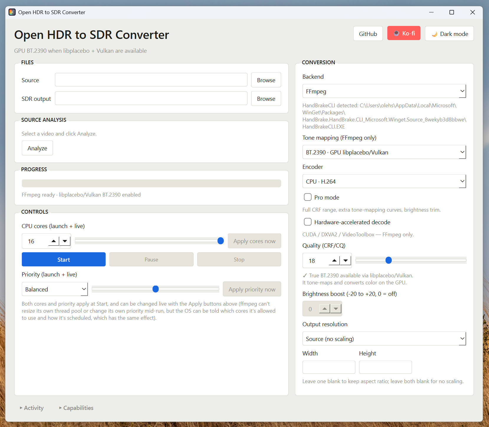

# Open HDR to SDR Converter

A desktop tone-mapping tool for people who care which curve they're using — standard FFmpeg, true BT.2390 on the GPU, or HandBrakeCLI, with the exact command always visible. 10-bit and 12-bit output included, free.


**[Website](https://openhdrtosdr.com/)** · **[Latest release](https://github.com/godysdev/Open-HDR-to-SDR-convertor/releases/latest)**



## Why

If you're just a user who wants to convert HDR to SDR, you shouldn't have to learn FFmpeg first.

Right now the choice is usually one of two extremes: paid software with a clean interface, or FFmpeg/HandBrake — free, powerful, and correct, but built for people who already know what BT.2390 means and are comfortable on a command line. There's not much in between.

This app is built to be that middle ground. It does exactly one job — HDR to SDR — and does it using nothing but your own hardware and open-source tools already capable of doing it right (FFmpeg, libplacebo/Vulkan, optionally HandBrakeCLI). No subscription, no cloud processing, no black-box "auto" button standing in for a real answer. Just a normal window: pick a curve, pick an encoder, hit start, and see the exact command that ran.

## Backends

Three genuinely different pipelines, not one "auto" button:

| Backend | Type | Curves | Notes |
|---|---|---|---|
| **Standard FFmpeg** | CPU | Hable, Reinhard, Mobius (+ Linear, Gamma, Clip, None in Pro mode) | Fast, works everywhere FFmpeg does, no GPU required |
| **libplacebo / Vulkan** | GPU | BT.2390 by default; BT.2446A, ST2094-10, ST2094-40 (HDR10+), Auto in Pro mode | Runs the real ITU-R BT.2390 EETF — the same curve most HDR-to-SDR grades are built around |
| **HandBrakeCLI** | Experimental | Same resolution/encoder controls | Alternate encode path for sources where HandBrake's own pipeline behaves better |

## Features

- **True BT.2390 tone mapping** via libplacebo/Vulkan — not a CPU approximation
- **10-bit & 12-bit output** — free, no license, no separate build. 10-bit works with any H.265 encoder (CPU or hardware); 12-bit is CPU libx265 only, since no common hardware encoder does 12-bit HEVC
- **Full curve library** — Hable, Reinhard, Mobius, BT.2446A, ST2094-10/40, Linear, Gamma, Clip, None, each with a hover tooltip explaining its actual tradeoffs
- **Source-aware curve recommendation** — Analyze reads the file's transfer characteristics and HDR10+/Dolby Vision metadata and suggests a curve for that specific source, rather than assuming one setting fits everything
- **Live Preview** — a real decoded-and-tone-mapped frame from your source, refreshed as you change settings, with a shadow/highlight clipping check so you can catch a curve crushing detail before committing to a full encode
- **Live bitrate estimate** — updates automatically as you change quality, resolution, or encoder, so a surprising CRF/resolution combo shows up before you hit Start, not after
- **Hardware encoding** — CPU (x264/x265), NVIDIA NVENC, AMD AMF, Apple VideoToolbox
- **Resolution presets** — Source, 4K, 1440p, 1080p, 720p, 480p, or custom; scaling is height-driven with width computed to match, so non-16:9 sources aren't stretched
- **Hardware-accelerated decode** — CUDA / DXVA2 / VideoToolbox (FFmpeg backend)
- **Drag and drop** — drop a video file anywhere on the window to set it as the source
- **Live run controls** — pause/resume, live CPU-core affinity, and process priority, all adjustable mid-conversion
- **Live resource monitoring** — CPU and GPU usage shown while converting
- **Activity & Capabilities panels** — a live log of the actual FFmpeg/HandBrake output, and a report of what's detected on your system (FFmpeg, Vulkan, HandBrakeCLI) before you convert
- **One-click Windows setup** — missing FFmpeg/HandBrakeCLI installed via `winget` from inside the app
- **Transparent by design** — the exact command line is always visible, never hidden behind "auto"
- Light and dark themes

## Requirements

| Component | Needed for |
|---|---|
| Python 3.10+ | Running the app itself |
| PySide6 | The Qt-based UI |
| FFmpeg | Standard and GPU tone-mapping backends |
| Vulkan-capable GPU + drivers | The libplacebo/BT.2390 backend specifically |
| HandBrakeCLI *(optional)* | The experimental HandBrake backend |
| psutil *(optional)* | Live pause/resume, CPU-core control, resource stats |

On Windows, missing FFmpeg/HandBrakeCLI can be installed automatically from inside the app via `winget` — see the Capabilities panel.

## Install & run

```bash
git clone https://github.com/godysdev/Open-HDR-to-SDR-convertor.git
cd Open-HDR-to-SDR-convertor
pip install -r requirements.txt
python hdr_to_sdr_gui_qt.py
```

Or grab a prebuilt Windows `.exe` from the [latest release](https://github.com/godysdev/Open-HDR-to-SDR-convertor/releases/latest) — no Python required, though FFmpeg is still needed separately.

### 10-bit / 12-bit output

10-bit and 12-bit are built into the CONVERSION card as a bit-depth selector — no separate script or build. Picking a depth filters the encoder list down to whatever your FFmpeg/HandBrakeCLI build can actually produce at that depth (e.g. only libx265 for 12-bit), rather than offering combinations that don't exist. Free, no license needed.

## Basic workflow

1. Pick a **Source** HDR file and an **SDR output** path, then click **Analyze**. Analysis reports the transfer function, bit depth, and duration, and suggests a curve based on what it finds (plain HDR, HDR10+ metadata, Dolby Vision, or footage that's already SDR).
2. Choose a **backend** and **curve** — BT.2390 on GPU is the sane default; fall back to Standard FFmpeg without a Vulkan-capable GPU. Hover a curve for a plain-language rundown of what it trades off.
3. Set **resolution**, **encoder**, and **bit depth**. Leave resolution on "Source" to keep the original frame size and aspect ratio.
4. Adjust **quality**, or enable **Pro mode** for the full CRF/CQ range, extra curves, and a brightness trim. Check the **Live Preview** panel — it shows an actual tone-mapped frame and flags shadow/highlight clipping — and the live bitrate estimate before committing.
5. Click **Start** — progress, speed, ETA, and live FFmpeg/HandBrake output are all shown as it runs. Pause/resume, CPU-core limits, and process priority can all be adjusted mid-conversion.

## Building a standalone executable

```bash
pip install pyinstaller
pyinstaller --windowed --onefile --icon=icon.ico hdr_to_sdr_gui_qt.py
```

Drop `icon.ico` next to the script beforehand and it's picked up automatically, both in-app and as the exe's file icon. There's only one entry point — 10-bit/12-bit output is part of the same build, not a separate exe.

## Troubleshooting

- **BT.2390 (GPU) option greyed out** — no Vulkan-capable device was detected; use a Standard FFmpeg curve instead.
- **HandBrakeCLI backend missing** — it's optional and only appears once HandBrakeCLI is found on your PATH.
- **Conversion feels like it's taking over the machine** — drop Process priority to Efficiency, or lower the CPU-core count live during a run.

## Support

If this saved you a re-encode: [♥ Support on Ko-fi](https://ko-fi.com/devgodys)

## License

[MIT](LICENSE)
